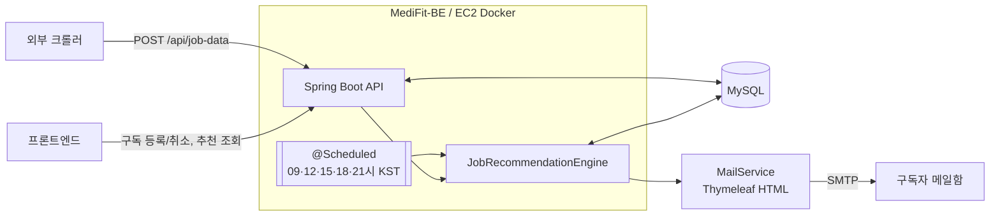
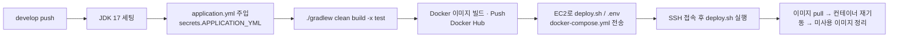

# MediFit-BE

간호사 · 간호조무사를 위한 **맞춤 채용 공고 추천 & 이메일 발송 서비스**의 백엔드입니다.

구독자가 희망 조건(지역 · 진료과 · 급여 · 근무요일 · 복지 · 경력)을 등록해두면,
크롤러가 수집한 병원 채용 공고 중 조건에 맞는 공고를 골라 하루 5회 이메일로 보내줍니다.

---

## 목차

- [서비스 현황](#서비스-현황)
- [주요 기능](#주요-기능)
- [기술 스택](#기술-스택)
- [시스템 구성](#시스템-구성)
- [패키지 구조](#패키지-구조)
- [추천 알고리즘](#추천-알고리즘)
- [API 명세](#api-명세)
- [도메인 Enum](#도메인-enum)
- [로컬 실행](#로컬-실행)
- [배포 (CI/CD)](#배포-cicd)
- [협업 규칙](#협업-규칙)

---

## 서비스 현황

메디컬 직군을 대상으로 **연봉 탐색 콘텐츠 페이지**와 **채용 공고 알림 랜딩페이지**를 운영 중이며,
이 저장소는 그중 공고 수집 · 매칭 · 알림 발송을 담당하는 백엔드입니다.

| 지표 | 수치 | 설명 |
|---|---|---|
| WAU | **1,500명+** | 주간 웹사이트 방문자 |
| 결과 페이지 전환율 | **38.7%** | 메디컬 직군 유입 테스트 → 결과 페이지 도달 |
| 공고 탐색률 | **28.6%** | 사용자 행동 데이터 기준, 공고 목록 탐색 비율 |
| 상세 공고 탐색률 | **61.9%** | 공고 목록에서 상세 공고까지 진입한 비율 |

---

## 주요 기능

| 기능 | 설명 |
|---|---|
| 채용 공고 수집 | 외부 크롤러가 `POST /api/job-data` 로 공고를 전송하면 저장. `link` 기준 중복 공고는 무시 |
| 채용 공고 CRUD | 수집된 공고의 조회 · 생성 · 수정 · 삭제 |
| 공고 검증 | 미검증 공고를 조회하고, 수정한 내용을 검증 테이블(`validated_job_data`)에 별도 저장 |
| 구독자 관리 | 희망 근무 조건을 포함한 구독자 등록 / 이메일 기준 구독 취소 |
| 맞춤 공고 추천 | 구독자별 조건 매칭 점수를 계산해 상위 5건 추천. 이미 추천한 공고는 제외 |
| 추천 이력 조회 | 이메일로 지금까지 추천받은 공고 목록 조회 |
| 이메일 발송 | Thymeleaf HTML 템플릿 기반 추천 메일 발송 + 전체 공지 메일 발송 |
| 스케줄링 | 매일 **09 / 12 / 15 / 18 / 21시 (KST)** 자동 추천 + 메일 발송 |

---

## 기술 스택

| 구분 | 사용 기술 |
|---|---|
| Language | Java 17 |
| Framework | Spring Boot 3.4.5 (Web, Data JPA, Validation, Mail, Thymeleaf) |
| Build | Gradle (Wrapper 포함) |
| Database | MySQL (`mysql-connector-j`) |
| API Docs | springdoc-openapi 2.5.0 (Swagger UI) |
| 기타 | Lombok, Spring Scheduling, JPA Auditing |
| Infra | Docker, Docker Compose, GitHub Actions, Docker Hub, AWS EC2 |

---

## 시스템 구성



---

## 패키지 구조

도메인별로 나눈 뒤, 각 도메인 안에서 **헥사고날(포트 & 어댑터)** 구조를 따릅니다.
`user` 모듈이 포트/어댑터를 가장 명확하게 적용한 형태이고, `jobdata` · `mail` 모듈은 `adapter → application → domain` 계층 분리만 적용되어 있습니다.

```
com.medifitbe
├── core                        # 공통 설정 · 공통 엔티티
│   ├── config                  # JpaAuditingConfig, SchedulerConfig, SwaggerConfig
│   └── entity                  # TimeBaseEntity (createdAt / updatedAt 자동 관리)
│
├── jobdata                     # 채용 공고 · 추천
│   ├── adapter
│   │   ├── (controller)        # JobData, JobPosting, JobValidation,
│   │   │                       # JobRecommendation, JobRecommendationHistory
│   │   ├── in/request|response # JobDataRequest, JobDataResponse
│   │   └── out/persistence     # JobDataEntity, ValidatedJobDataEntity,
│   │                           # JobRecommendationHistoryEntity + Repository
│   ├── application/service     # JobDataService, JobPostingService, JobValidationService,
│   │                           # JobRecommendationService, JobRecommendationEngine,
│   │                           # JobRecommendationHistoryService
│   └── domain                  # JobRecommendation
│
├── user                        # 구독자
│   ├── adapter
│   │   ├── SubscriberApi       # Swagger 문서용 인터페이스
│   │   ├── SubscriberController
│   │   ├── in/request          # CreateSubscriberRequest, DeleteSubscriberRequest
│   │   └── out/persistence     # SubscriberEntity, RegionGroupEntity + Repository
│   │                           # SubscriberPersistenceAdapter (out 포트 구현)
│   ├── application
│   │   ├── port/in             # CreateSubscriberUseCase, DeleteSubscriberUseCase
│   │   ├── port/out            # CreateSubscriberPort, DeleteSubscriberPort
│   │   └── service             # CreateSubscriberService, DeleteSubscriberService
│   ├── domain                  # Subscriber, RegionGroup + Enum 모음
│   └── mapper                  # SubscriberMapper (Request ↔ Domain ↔ Entity)
│
└── mail                        # 메일 발송
    ├── adapter/in              # MailController, BroadcastMailRequest
    └── application/service     # MailService, EmailBroadcastService (@Scheduled)
```

---

## 추천 알고리즘

`JobRecommendationEngine.recommend()` 는 **하드 필터 → 점수 계산 → 상위 5건 선별** 순으로 동작합니다.

### 1단계 · 후보 축소 (하드 필터)

| 필터 | 기준 |
|---|---|
| 신규 공고 | 해당 구독자의 마지막 추천 시각(`job_recommendation_history.createdAt`) 이후 생성된 공고만 |
| 직종 | 공고의 `jobType` 과 구독자 `jobType`(간호사 / 간호조무사)이 일치해야 함 |
| 경력 | 공고 요구 경력이 구독자 경력(개월)보다 높으면 제외. `"간호사 1년"`, `"6개월"` 같은 문자열을 정규식으로 파싱 |
| 지역 | 구독자 지역 그룹 중 **세부 지역(minor)이 반드시 포함**되고, 지역 토큰 간 Jaccard 유사도 ≥ 0.3 이어야 함. 불일치 시 점수 0.0 으로 즉시 탈락 |

### 2단계 · 유사도 점수 (6개 항목 / 각 1점)

| 항목 | 매칭 방식 |
|---|---|
| 지역 | 위 하드 필터 통과 시 1점 (통과 못 하면 전체 0.0) |
| 진료과 | 구독자 희망 진료과가 공고 `responsibilities` 에 포함되는지 |
| 급여 | 공고 급여 문자열에서 숫자 추출 → 만원 단위 환산 → 구독자 급여 단위(시급/월급/연봉)로 변환 후 희망 최소 급여와 비교<br/>(시급↔월급 환산 기준 근무시간 **209시간**) |
| 근무요일 | 구독자 희망 요일이 공고 `workingDays` 에 포함되는지 |
| 복지 | 구독자 선호 복지가 공고 `welfare` 에 포함되는지 |
| 경력 | 공고 요구 경력을 충족하는지. `"무관"`, `"관계없음"` 이거나 경력 정보가 없으면 통과 |

`score = matched / 6` 이며, **0.4 이상**인 공고만 추천 후보로 남습니다.

### 3단계 · 정렬 및 중복 제거

1. 점수 내림차순 정렬 후 **상위 5건**만 선택
2. `JobRecommendationService` 에서 `(subscriberId, jobId)` 이력을 확인해 이미 추천한 공고 제거
3. 남은 공고를 추천 이력에 저장하고, 구독자 이메일별 `Map<email, List<JobRecommendation>>` 반환
4. `EmailBroadcastService` 가 추천 결과가 있는 구독자에게만 HTML 메일 발송

> 크롤링한 공고의 급여 · 경력 · 지역이 모두 비정형 문자열이라, 정규식 파싱과 단위 환산을 거쳐 비교합니다.

---

## API 명세

Swagger UI: `http://{host}:8080/swagger-ui/index.html`

### 채용 공고 — `JobDataController`

| Method | Endpoint | 설명 |
|---|---|---|
| `GET` | `/api/jobdata` | 전체 채용 공고 조회 |
| `GET` | `/api/jobdata/{id}` | 단일 채용 공고 조회 |
| `POST` | `/api/jobdata` | 채용 공고 생성 |
| `PUT` | `/api/jobdata/{id}` | 채용 공고 수정 |
| `DELETE` | `/api/jobdata/{id}` | 채용 공고 삭제 |

### 공고 수집 — `JobPostingController`

| Method | Endpoint | 설명 |
|---|---|---|
| `POST` | `/api/job-data` | 크롤러 전용 저장 엔드포인트. 동일 `link` 존재 시 저장 생략 |

### 공고 검증 — `JobValidationController`

| Method | Endpoint | 설명 |
|---|---|---|
| `GET` | `/jobs/unvalidated` | 미검증 공고 목록 조회 |
| `POST` | `/jobs/validate` | 검증·보정된 공고를 `validated_job_data` 에 저장 |

### 추천 — `JobRecommendationController` / `JobRecommendationHistoryController`

| Method | Endpoint | 설명 |
|---|---|---|
| `GET` | `/api/recommendations/all` | 전체 구독자에 대한 추천 실행 및 결과 반환 (이력 저장 포함) |
| `GET` | `/api/recommendations?email=` | 특정 구독자가 추천받은 공고 목록 조회 |

### 구독자 — `SubscriberController`

| Method | Endpoint | 설명 |
|---|---|---|
| `POST` | `/api/v1/subscribers` | 구독자 등록 (희망 조건 포함) |
| `DELETE` | `/api/v1/subscribers` | 이메일 기준 구독 취소 |

### 메일 — `MailController`

| Method | Endpoint | 설명 |
|---|---|---|
| `POST` | `/api/mail/broadcast` | 전체 구독자에게 공지 메일 발송 |
| `POST` | `/api/mail/recommendations/send-mail` | 추천 메일 즉시 발송 (스케줄러와 동일 로직 수동 실행) |

<details>
<summary>구독자 등록 요청 예시</summary>

```json
{
  "email": "user@example.com",
  "gender": false,
  "jobType": "간호사",
  "regionGroups": [
    { "major": "서울", "minors": ["강남구", "서초구"] },
    { "major": "경기", "minors": ["수원시", "성남시"] }
  ],
  "departments": ["내과", "정신건강의학과"],
  "workTypes": ["풀타임"],
  "workdays": ["월", "화", "수"],
  "weekendWork": "가급적 쉬고 싶음",
  "welfarePreferences": ["식대", "연차 보장"],
  "wageUnit": "월급",
  "salaryMin": 2500000,
  "careerType": "무관",
  "experienceMonths": 0
}
```

</details>

---

## 도메인 Enum

`WorkType` · `Welfare` · `WeekendWork` 는 `@JsonValue` / `@JsonCreator` 로 **한글 라벨을 그대로 직렬화**합니다.

| Enum | 값 |
|---|---|
| `JobType` | 간호사, 간호조무사 |
| `RegionMajor` | 서울, 경기, 인천, 대전, 세종, 충남, 충북, 광주, 전남, 전북, 대구, 경북, 부산, 울산, 경남, 강원, 제주, NONE |
| `Department` | 내과, 외과, 정형외과 … 수술실, 응급실, 중환자실 등 40개 + NONE |
| `WorkType` | 풀타임, 파트타임 오전(9-13시), 파트타임 오후(14-18시), 파트타임 저녁(18시 이후), 협의 가능, NONE |
| `Workday` | 월, 화, 수, 목, 금, 토, 일, NONE |
| `WeekendWork` | 가능, 가급적 쉬고 싶음, 휴무를 원함, NONE |
| `Welfare` | 식대, 교통비, 상여금, 연차 보장, 점심시간 보장, 상관없음, NONE |
| `WageUnit` | 시급, 일급, 월급, NONE |
| `CareerType` | 무관, 경력, 신입, NONE |

---

## 로컬 실행

### 요구 사항

- JDK 17
- MySQL 8.x
- SMTP 계정 (Gmail 앱 비밀번호 등)

### 1. 설정 파일 작성

`application.yml` 은 `.gitignore` 에 포함되어 저장소에 없습니다. `src/main/resources/application.yml` 을 직접 만들어 주세요.

```yaml
spring:
  datasource:
    url: jdbc:mysql://localhost:3306/medifit?serverTimezone=Asia/Seoul&characterEncoding=UTF-8
    username: {DB_USER}
    password: {DB_PASSWORD}
    driver-class-name: com.mysql.cj.jdbc.Driver

  jpa:
    hibernate:
      ddl-auto: update
    properties:
      hibernate:
        format_sql: true

  mail:
    host: smtp.gmail.com
    port: 587
    username: {MAIL_ACCOUNT}
    password: {MAIL_APP_PASSWORD}
    properties:
      mail:
        smtp:
          auth: true
          starttls:
            enable: true
```

> 운영 환경에서는 GitHub Actions Secret `APPLICATION_YML` 의 값이 빌드 시점에 주입됩니다.

### 2. 빌드 & 실행

```bash
./gradlew clean build          # 빌드
./gradlew bootRun              # 실행
java -jar build/libs/MediFit-BE-0.0.1-SNAPSHOT.jar   # JAR 실행
```

### 3. 확인

- API 서버: http://localhost:8080
- Swagger UI: http://localhost:8080/swagger-ui/index.html

> 실행과 동시에 스케줄러가 활성화됩니다. 로컬에서 실제 메일이 나가지 않게 하려면 `SchedulerConfig` 의 `@EnableScheduling` 을 비활성화하세요.

---

## 배포 (CI/CD)

`develop` 브랜치에 push 하면 `.github/workflows/dev-deploy.yml` 이 실행됩니다.



### 관련 파일

| 경로 | 역할 |
|---|---|
| `.github/workflows/dev-deploy.yml` | 빌드 → 이미지 push → EC2 배포 파이프라인 |
| `Dockerfile` | `openjdk:17-jdk-slim` 기반, 8080 포트 노출 |
| `infra/deploy/docker-compose.yml` | 백엔드 컨테이너 정의 (로그 볼륨, `medifit_network`) |
| `infra/deploy/scripts/deploy.sh` | Docker 설치 확인 → 컨테이너 교체 → 이미지 정리 |

### 필요한 GitHub Secrets

`APPLICATION_YML`, `ENV_FILE`, `DOCKER_USERNAME`, `DOCKER_PASSWORD`, `AWS_HOST`, `AWS_USER`, `AWS_PRIVATE_KEY`

---

## 협업 규칙

### 브랜치

- `main` — 배포 기준 브랜치
- `develop` — 개발 통합 브랜치 (배포 파이프라인 트리거)
- `MF-{이슈번호}` — 작업 브랜치

### 커밋 / PR 제목

```
[MF-19] 공고목록 CRUD 추가
MF-20/fix: 트랜잭션 범위 수정
```

PR 은 `.github/PULL_REQUEST_TEMPLATE.md` 형식(작업 개요 / 작업 내용 / 관련 이슈 / 리뷰 요구사항)에 맞춰 작성합니다.
